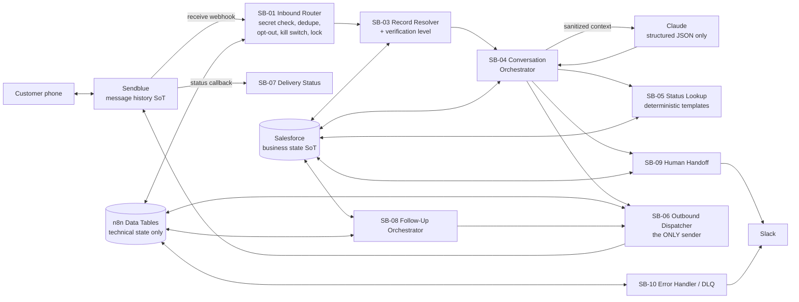

# Emma — Big Think Capital AI Funding Agent

Production-grade AI business-financing assistant built on **Sendblue**
(iMessage/SMS), **n8n** (orchestration), **Claude** (language understanding),
**Salesforce** (CRM source of truth), and **Slack** (human handoff), with
**n8n Data Tables** for technical state and **GitHub Actions** for validation.

The assistant's name is configurable (`ASSISTANT_NAME`); **Emma** is the
default.

> ⚠️ **Not production-active as shipped.** Every customer-facing string is a
> placeholder pending compliance approval (see `COMPLIANCE-REVIEW.md`), test
> mode is on by default, and Journey F outreach is disabled by default.

## What Emma does

- Receives inbound Sendblue messages, creates/locates the Salesforce record,
  and conversationally qualifies new leads (Journey A/B).
- Answers approved FAQ questions and record-status questions with
  deterministic, compliance-approved wording only (Journey C/D).
- Sends the secure application link, schedules calls, and hands off to humans
  with a Slack summary + Salesforce Task (Journey E).
- Optional, disabled-by-default outreach to consented Salesforce leads
  (Journey F).
- Enforces opt-out, wrong-number, human-takeover, per-record AI toggles, a
  global kill switch, verification levels, messaging hours, idempotency, and
  rate limits — all **outside** the model, in deterministic n8n logic.

Emma never makes underwriting, approval, denial, pricing, legal, or
adverse-action decisions, and Claude can never directly send a message or
change a Salesforce stage.

## Architecture (summary)



Source-of-truth split: **Sendblue** owns transcripts/handles/delivery,
**Salesforce** owns identity/qualification/stage/consent/takeover, **n8n Data
Tables** own only idempotency, locks, retries, dead-letter, global config,
FAQ cache, technical follow-up jobs, and test results. No external database —
see `docs/ARCHITECTURE.md` for the full rationale.

## Repository layout

| Path | Contents |
|------|----------|
| `workflows/` | 12 importable n8n workflows, SB-00 … SB-11 |
| `prompts/` | Emma system prompt, structured-output JSON Schema, fallbacks, summary prompt |
| `config/` | All business rules as `.example.json` templates |
| `data-tables/` | Required n8n Data Table definitions + example seed data |
| `scripts/` | Validator, Salesforce/Sendblue discovery, test harness, gated n8n deploy |
| `tests/` | Fixtures, mocks, expected results, TEST-REPORT.md |
| `docs/` | Architecture, setup, identity/privacy, runbook, testing, rollback |
| `.github/workflows/validate.yml` | CI: validation + test harness on every PR |

## Quick start

```bash
npm run validate        # validate all workflow JSON + security rules
npm test                # run the mocked test harness
npm run test:report     # regenerate tests/TEST-REPORT.md + JSON report
```

Deployment order (details in `docs/DEPLOYMENT.md`):

1. `cp .env.example .env` and fill in credentials (never commit).
2. `npm run inspect:salesforce && npm run generate:sf-map` — generate the org
   field map, then resolve every `UNMAPPED` required mapping.
3. Create the n8n Data Tables from `data-tables/definitions.json` and seed
   from `data-tables/seed-data.example.json`.
4. Import the 12 workflows (or `npm run deploy:n8n` — requires `N8N_API_URL`,
   `N8N_API_KEY`, **and** `ALLOW_N8N_WRITE=true`; otherwise it only writes
   local files), and attach real n8n credentials to the placeholder slots.
5. Run **SB-00 Discovery & Health Check** until it reports GREEN.
6. Register Sendblue webhooks (`docs/SENDBLUE-SETUP.md`).
7. Complete `COMPLIANCE-REVIEW.md`, keep `TEST_MODE=true` through UAT, then
   flip `TEST_MODE=false` + `ALLOW_REAL_SEND=true` only at launch.

## Safety gates

| Gate | Default | Effect |
|------|---------|--------|
| `global_ai_enabled` (config table) | `false` | Kill switch — every workflow checks it |
| `test_mode` / `TEST_MODE` | `true` | Sends mocked or restricted to test allowlist |
| `ALLOW_REAL_SEND` | `false` | Second key required for any real send |
| `ALLOW_N8N_WRITE` | `false` | Deploy script cannot touch a live n8n |
| SB-02 outreach | disabled | Journey F requires explicit enable + consent fields |

## Documentation index

Start with `docs/ARCHITECTURE.md`, then `docs/DEPLOYMENT.md`. Operational
procedures live in `docs/OPERATIONS-RUNBOOK.md`; every unverified external
behavior is catalogued in `ASSUMPTIONS.md`.
