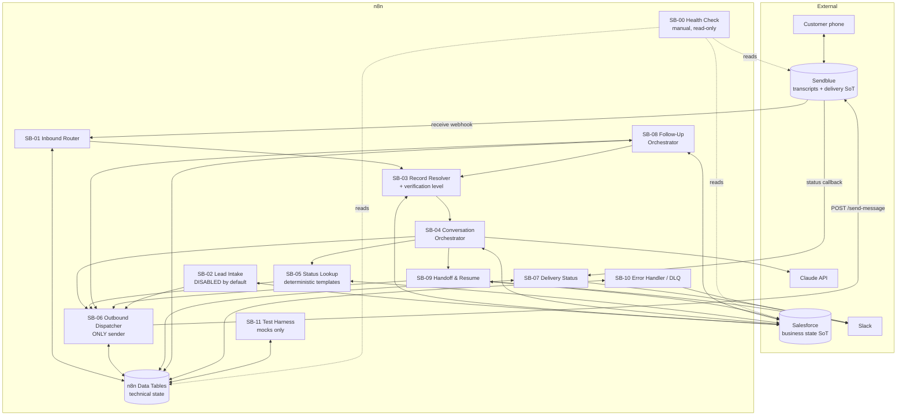
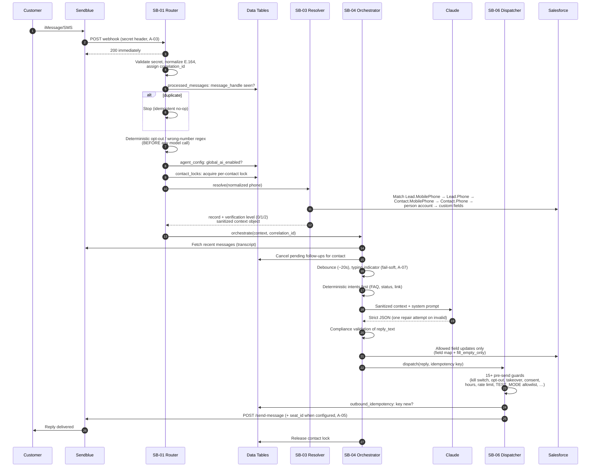

# Architecture

Emma is a set of 12 importable n8n workflows that connect **Sendblue**
(iMessage/SMS), **Claude** (Anthropic Messages API), **Salesforce** (CRM), and
**Slack** (human handoff). There is no application server and no external
database: n8n executes everything, and all state lives in exactly three
stores. This document explains the components, the source-of-truth split, the
message flow, and the safety mechanics (idempotency, locking, precedence,
correlation) that make the system deterministic where it matters.

> Compliance status of any customer-facing behavior described here is tracked
> in [`../COMPLIANCE-REVIEW.md`](../COMPLIANCE-REVIEW.md) — nothing in this
> document implies content or conduct has been approved.

## 1. Component responsibilities

| Component | Responsibility | Never does |
|-----------|----------------|-----------|
| **Sendblue** | Transport (iMessage/SMS), message history / transcripts, delivery statuses, opt-out enforcement at the carrier layer, seats for attribution | Business logic, qualification state |
| **n8n** | All orchestration, every deterministic rule (opt-out regex, kill switches, verification levels, compliance validation, rate limits, idempotency), Data Tables for technical state | Storing CRM data or transcripts |
| **Claude** | Language understanding + drafting: returns one structured JSON object per turn (intent, extracted fields, proposed reply, handoff recommendation) | Sending messages, writing Salesforce, deciding status wording, making credit decisions |
| **Salesforce** | Business state: identity, qualification fields, stage, consent, opt-out flag, human-takeover flag, tasks, ownership | Technical plumbing (locks, idempotency, retries) |
| **Slack** | Human handoff notifications (`SLACK_HANDOFF_CHANNEL_ID`) and operational alerts (`SLACK_ALERTS_CHANNEL_ID`) | Acting as a state store |

### The 12 workflows

| ID | Name | Trigger | Role |
|----|------|---------|------|
| SB-00 | Discovery & Health Check | Manual | Red/yellow/green readiness report. **Never messages customers.** |
| SB-01 | Inbound Webhook Router | `POST …/webhook/sendblue/inbound` | Secret validation, fast 200, E.164 normalization, correlation ID, dedupe, deterministic opt-out/wrong-number, kill-switch check, per-contact lock; calls SB-03 → SB-04 |
| SB-02 | Salesforce Lead Intake Trigger | Salesforce polling/trigger | Journey F outreach. **Disabled by default**, consent-gated (see ASSUMPTIONS.md A-18) |
| SB-03 | Record Resolver & Verification | Called by SB-01/SB-08 | Deterministic phone match, converted-lead resolution, never guesses on multiple matches, computes verification level 0/1/2, builds the sanitized context object |
| SB-04 | Conversation Orchestrator | Called by SB-01 | Fetch recent Sendblue transcript, cancel follow-ups, debounce, typing indicator (fail-soft), deterministic intents first, Claude call + one JSON repair attempt, compliance validation, permitted Salesforce updates, calls SB-06, releases lock |
| SB-05 | Process Status Lookup | Called by SB-04 | Deterministic status templates only; verification-level enforcement; escalates ambiguity; the model never invents status |
| SB-06 | Outbound Dispatcher | Called by SB-02/04/05/08/09 | **The only workflow that calls Sendblue `/send-message`.** 15+ pre-send guards (see §7) |
| SB-07 | Delivery Status Webhook | `POST …/webhook/sendblue/status` | Idempotent by `message_handle`; alerts on repeated failures / 401 / 429 / line issues; **never resends** |
| SB-08 | Follow-Up Orchestrator | Schedule | Salesforce-first business state; rechecks everything immediately before send; max attempts; cancel on reply; records skip reasons |
| SB-09 | Human Handoff & Resume | Called by SB-04 / manual | Sets human takeover, cancels follow-ups, Salesforce Task, Slack summary, optional single transfer message; authorized resume path |
| SB-10 | Error Handler & DLQ | n8n Error Trigger (global) | Retryable vs non-retryable classification, sanitized `dead_letter_events` rows, grouped Slack alerts, safe replay preserving idempotency |
| SB-11 | Automated Test Harness | Manual | Mocks + fake numbers only (~48 scenarios); writes `test_results` + report |

## 2. Source-of-truth split — and why there is no external database

Each fact in the system has exactly one authoritative home:

1. **Sendblue owns the conversation.** Message bodies, media, handles,
   delivery statuses, and timestamps already persist in Sendblue and are
   retrievable by API. Duplicating transcripts into our own store would create
   a second copy of customer PII to secure, reconcile, and eventually purge —
   for no functional gain, since SB-04 fetches recent history on demand.
2. **Salesforce owns the business.** Identity, qualification answers, stage,
   consent, opt-out, takeover, ownership, and tasks are CRM facts that humans
   at Big Think Capital already read and edit in Salesforce. Mirroring them
   elsewhere would guarantee drift between what Emma believes and what the
   team sees. SB-08 deliberately reads business eligibility from Salesforce at
   send time, not from a cached copy.
3. **n8n Data Tables own the plumbing.** Idempotency keys, locks, retry
   counters, dead-letter events, global config/kill switches, the optional FAQ
   cache, fallback follow-up jobs, and test results are purely technical,
   small, short-lived (most tables have retention windows of 1–90 days), and
   only meaningful to the workflows themselves. The 9 tables are defined in
   [`../data-tables/definitions.json`](../data-tables/definitions.json).

Because those three stores cover every datum, an external database would add
an operational dependency (hosting, backups, credentials, another PII
surface) without adding a single capability. This is a deliberate design
decision recorded as ASSUMPTIONS.md A-20.

**Revisit condition:** if outbound volume grows past what per-item Data Table
reads/writes comfortably support (e.g., idempotency checks or rate-limit
counters become a measurable bottleneck, or retention/analytics needs exceed
what Data Tables offer), revisit this decision — the likely first step is
moving only the *technical* tables to a managed store, never the transcripts
or CRM data.

## 3. Workflow topology

### Inbound message, end to end

## 4. Data residency

| Data | Lives in | Never in | Retention |
|------|----------|----------|-----------|
| Message bodies / transcripts / media | Sendblue | Data Tables, logs, Slack alerts | Sendblue policy |
| Delivery statuses per message | Sendblue → mirrored technically in `outbound_idempotency` (status only, no content) | — | 30 days (table) |
| Identity, qualification answers, stage, consent, opt-out, takeover | Salesforce | Data Tables | Salesforce policy |
| Conversation summary for humans | Salesforce (`ai_conversation_summary` mapping) | — | Salesforce policy |
| Idempotency keys, locks, retry counters | n8n Data Tables | — | 1–30 days |
| Dead-letter events (sanitized: no bodies, phone hashed) | `dead_letter_events` | — | 90 days |
| Global config / kill switches | `agent_config` | — | Permanent |
| Raw phone numbers | Sendblue + Salesforce only; Data Tables store a **hash** (`normalized_phone_hash`) | Logs, DLQ, test results | — |
| Sensitive data a customer texts (SSN etc.) | Nowhere — detected, never repeated, never copied to Salesforce, redacted in logs | Everywhere | — |
| API keys / secrets | n8n credentials + local `.env` (uncommitted) | Workflow JSON, repo, logs | — |

## 5. Control precedence

Evaluated in this strict order; the first matching control wins:

1. **Global disable** — `agent_config.global_ai_enabled = false` (default).
   Nothing automated runs, anywhere.
2. **Opt-out** — Salesforce `sms_opt_out` (plus Sendblue-layer opt-out, A-08).
   No message of any kind except the single opt-out confirmation.
3. **Human takeover** — Salesforce `human_takeover = true`. Emma is silent on
   that record; the human owns the thread.
4. **Per-record AI toggle** — Salesforce `ai_enabled = false`. Emma is silent
   on that record without a formal handoff.

Further gates (wrong number, consent, messaging hours, rate limits,
`TEST_MODE`) apply after precedence in SB-06 — see §7. All of these are
deterministic n8n logic; none rely on the model behaving.

## 6. Idempotency design

**Inbound:** Sendblue may retry webhooks; SB-01 dedupes on the Sendblue
`message_handle`, stored uniquely in `processed_messages`. A handle seen
before is dropped before any processing. Outcome (`processed`, `duplicate`,
`opt_out`, …) is recorded per handle.

**Outbound:** every candidate send carries an idempotency key computed as
`correlation_id + recipient + content-hash`. SB-06 inserts it into
`outbound_idempotency` (unique column) before calling Sendblue; a key that
already exists is never sent again. This makes retries, SB-10 replays, and
double-triggering safe: identical content to the same recipient within the
same correlation can only leave once. SB-07 later updates the row's
`delivery_status` by `message_handle` — also idempotently — and SB-10 **never
replays a send that Sendblue already accepted** (`accepted_by_sendblue =
true`).

## 7. Outbound guard stack (SB-06)

Every send — from any workflow — passes all of: global kill switch;
`outbound_enabled`; per-record `ai_enabled`; human takeover; opt-out; wrong
number; consent (for proactive sends); non-blank content; compliance
forbidden-pattern scan; idempotency key uniqueness; messaging hours (proactive
only, A-17); global + per-contact rate limits; customer-replied-since-scheduled
check; `TEST_MODE` allowlist restriction. When `SENDBLUE_EMMA_SEAT_ID` is
configured, the Emma seat is attached for attribution (parameter name
configurable — see ASSUMPTIONS.md A-05).

## 8. Locking, debounce, and correlation

- **Per-contact lock** (`contact_locks`, keyed by `normalized_phone_hash`,
  with `expires_at` so a crashed execution can't wedge a contact): SB-01
  acquires it, SB-04 releases it, so two rapid inbound messages never produce
  interleaved processing for the same person.
- **Debounce** (SB-04, default 20 s per
  [`../config/follow-up-policy.example.json`](../config/follow-up-policy.example.json)):
  consecutive inbound messages inside the window are answered with one
  combined reply instead of one reply per message.
- **Correlation IDs**: SB-01 mints a `correlation_id` per inbound event; it is
  carried through SB-03/04/05/06/09, stored in `processed_messages`,
  `outbound_idempotency`, `contact_locks`, and `dead_letter_events`, and
  included in Slack handoff summaries — one ID traces a customer turn across
  every workflow and table. Tracing procedure:
  [`OPERATIONS-RUNBOOK.md`](OPERATIONS-RUNBOOK.md).

## 9. Where the model is (and isn't) in the loop

Claude sees a **sanitized context object** built by SB-03/SB-04: the minimum
fields needed for the turn (see
[`IDENTITY-AND-PRIVACY.md`](IDENTITY-AND-PRIVACY.md) §7). It returns strict
JSON validated against `prompts/structured-output-schema.json` with exactly
one repair attempt (A-13); invalid output falls back to deterministic
templates. Claude never calls Sendblue, never writes Salesforce, and its
proposed reply is only a *candidate* until SB-04 compliance validation and the
SB-06 guard stack pass. Opt-out and wrong-number detection run **before**
Claude, so a model outage cannot delay an opt-out.

## Related documents

- [`DEPLOYMENT.md`](DEPLOYMENT.md) — how to stand this up
- [`OPERATIONS-RUNBOOK.md`](OPERATIONS-RUNBOOK.md) — day-2 operations
- [`IDENTITY-AND-PRIVACY.md`](IDENTITY-AND-PRIVACY.md) — verification levels
- [`../ASSUMPTIONS.md`](../ASSUMPTIONS.md) — every unverified external behavior
